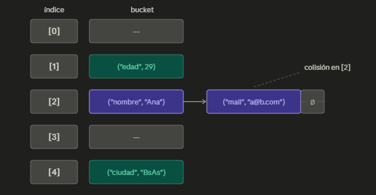
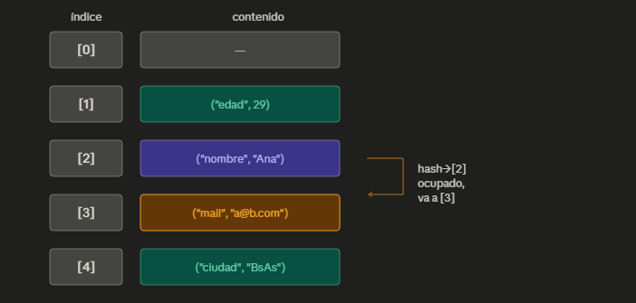

# Mapa / Diccionario (Hash Map)

## 1. Qué es y cómo funciona

### Intuición

Si imaginamos una biblioteca donde el título de cada libro te dice directamente
en qué estante está. No recorrés nada, no comparás uno por uno — vas
directo. Un HashMap funciona así: le das una clave, y la estructura te
devuelve el valor asociado de forma inmediata.

La magia está en la **función hash**: toma la clave y produce siempre
la misma dirección.

**Problema que resuelve:** Cualquier situación donde necesitás encontrar
algo por su nombre, no por su posición. Dado un identificador arbitrario
— un nombre de usuario, una palabra, un código de producto — obtener su
valor asociado de forma inmediata, sin recorrer nada ni comparar
uno por uno.

### Definición y propiedades

**Definición formal:** Un HashMap mantiene un conjunto de pares
clave→valor bajo tres reglas que nunca se rompen:

- Cada clave existe a lo sumo una vez. Insertar una clave ya existente
  reemplaza el valor anterior.
- La misma clave siempre produce el mismo índice. La función hash
  es determinista.
- Todo valor almacenado es alcanzable por su clave.

**Propiedades clave:**

- **Sin orden:** las claves no se guardan alfabéticamente ni por
  orden de inserción.
- **Claves únicas:** no pueden coexistir dos entradas con la misma
  clave.
- **Sin restricción sobre valores:** cualquier dato puede ser un valor;
  la unicidad aplica solo a las claves.

### Representación

Internamente, un HashMap es un conjunto de posiciones llamadas
**buckets**. Cada clave pasa por la función hash, que determina en qué
bucket se almacena el par clave→valor. Cuando dos claves caen en el
mismo bucket — una **colisión** — hay dos estrategias:

**Chaining:** cada bucket contiene una lista de pares. Las colisiones
se encadenan.



**Open addressing:** cada par vive directamente en el array. Ante una
colisión, se busca el siguiente bucket libre.



En chaining los buckets crecen hacia afuera; en open addressing todo
convive dentro de la misma estructura. En chaining, si muchas claves
colisionan en el mismo bucket, ese bucket puede crecer hasta n elementos
— ese es el peor caso de todas las operaciones.

## 2. Operaciones y complejidad

### Operaciones principales

- **`insert(key, value)`:** Agrega un nuevo par clave→valor al mapa. Si la clave ya existe, reemplaza el valor anterior.
- **`find(key)`:** Dado una clave, retorna el valor asociado. Si la clave no existe, lanza un error.
- **`delete(key)`:** Elimina un par clave→valor del mapa. Si la clave no existe, no tiene efecto.
- **`update(key, value)`:** Reemplaza el valor asociado a una clave existente por uno nuevo.

### Complejidad

| Operación | Promedio | Peor caso | Amortizado | Espacio adicional |
|---|---|---|---|---|
| `insert(key, value)` | O(1) | O(n) | O(1) | O(1) |
| `find(key)` | O(1) | O(n) | — | O(1) |
| `delete(key)` | O(1) | O(n) | — | O(1) |
| `update(key, value)` | O(1) | O(n) | — | O(1) |

> **Costo oculto — Rehash:** Cuando el HashMap supera cierto nivel de ocupación llamado _load factor_, crea un array del doble de tamaño y rehashea todas las claves existentes en sus nuevas posiciones. Este proceso cuesta O(n) ya que recorre todos los elementos, pero ocurre tan pocas veces que el costo amortizado de insertar sigue siendo O(1).

### Detalles operativos

- **Clave inexistente:** `find` lanza un error; `delete` no tiene efecto; `update` lanza un error.
- **Clave duplicada:** `insert` reemplaza el valor anterior.
- **Límite de tamaño:** el tamaño crece dinámicamente mediante rehashes.

---

## 3. Implementación

### Idea de implementación  
Un HashMap se implementa sobre un **array de buckets**, donde cada bucket contiene cero o más pares *(clave, valor)*.  

El flujo básico de cualquier operación es siempre el mismo:

1. Se aplica una función hash a la clave.
2. Se obtiene un índice dentro del array.
3. Se accede al bucket correspondiente.
4. Se opera dentro del bucket (buscar, insertar, eliminar).

Para resolver colisiones, la estrategia más simple y común es **chaining**, donde cada bucket es una lista.

**Algoritmos clave (chaining):**

- **insert(key, value):**
  1. Calcular índice: `i = hash(key) % capacidad`
  2. Recorrer el bucket:
     - Si la clave existe → reemplazar valor
     - Si no existe → agregar nuevo par
  3. Si el factor de carga supera el límite → rehash

- **find(key):**
  1. Calcular índice
  2. Recorrer bucket
  3. Si encuentra la clave → retorna valor
  4. Si no → error

- **delete(key):**
  1. Calcular índice
  2. Buscar en el bucket
  3. Si existe → eliminar
  4. Si no → no hace nada

- **update(key, value):**
  1. Calcular índice
  2. Recorrer el bucket
  3. Si encuentra la clave → reemplazar valor
  4. Si no → error

---

### Invariantes  
Estas condiciones deben cumplirse siempre, sin excepción:

- Cada clave aparece **como máximo una vez** en toda la estructura.
- El tamaño (`size`) coincide con la cantidad real de pares almacenados.
- Todos los elementos están en el bucket que corresponde a su hash.
- No hay buckets “perdidos”: todo elemento es alcanzable desde el array.
- La función hash aplicada a una clave siempre lleva al mismo bucket (mientras no haya rehash).
- El factor de carga (`size / capacidad`) se mantiene bajo cierto umbral (ej: 0.75).

Si alguno de estos invariantes se rompe, el HashMap deja de funcionar correctamente.

---

### Ejemplo de código (Python)

Implementación mínima usando **chaining**:

```python
class HashMap:
    def __init__(self, capacity=8):
        self.capacity = capacity
        self.size = 0
        self.buckets = [[] for _ in range(capacity)]

    def _hash(self, key):
        return hash(key) % self.capacity

    def insert(self, key, value):
        index = self._hash(key)
        bucket = self.buckets[index]

        for i, (k, v) in enumerate(bucket):
            if k == key:
                bucket[i] = (key, value)
                return

        bucket.append((key, value))
        self.size += 1

        if self.size / self.capacity > 0.75:
            self._rehash()

    def find(self, key):
        index = self._hash(key)
        bucket = self.buckets[index]

        for k, v in bucket:
            if k == key:
                return v

        raise KeyError("Clave no encontrada")

    def delete(self, key):
        index = self._hash(key)
        bucket = self.buckets[index]

        for i, (k, v) in enumerate(bucket):
            if k == key:
                del bucket[i]
                self.size -= 1
                return

    def update(self, key, value):
        index = self._hash(key)
        bucket = self.buckets[index]

        for i, (k, v) in enumerate(bucket):
            if k == key:
                bucket[i] = (key, value)
                return

        raise KeyError("Clave no encontrada")

    def _rehash(self):
        old_buckets = self.buckets
        self.capacity *= 2
        self.buckets = [[] for _ in range(self.capacity)]
        self.size = 0

        for bucket in old_buckets:
            for k, v in bucket:
                self.insert(k, v)
```

### Ejemplo de Uso típico

```python
m = HashMap()

m.insert("usuario1", 100)
m.insert("usuario2", 200)

print(m.find("usuario1"))  # 100

m.update("usuario1", 150)

print(m.find("usuario1"))  # 150

m.delete("usuario2")
```

### Salida esperada:

```
100
150
```

---

## 4. Uso y criterio

### Casos de uso

Un HashMap encaja naturalmente cuando el problema consiste en asociar claves con valores y acceder a ellos de manera rápida.

Ejemplos típicos:

- Conteo de frecuencias: cantidad de apariciones de palabras, letras o números.
- Índices por identificador: buscar usuarios por email, productos por código o alumnos por legajo.
- Cachés y memoización: guardar resultados ya calculados para evitar recomputarlos.
- Agrupamiento: agrupar elementos por categoría, fecha, autor, tipo, etc.
- Verificación de pertenencia: saber rápidamente si una clave ya existe.
- Tablas de configuración: guardar pares clave→valor como parámetros, opciones o variables.

En muchos problemas de programación competitiva o entrevistas aparece cuando el enunciado dice “buscar rápidamente”, “contar ocurrencias”, “detectar duplicados” o “asociar un identificador con un dato”.

### Cuándo NO usarlo

Aunque es muy eficiente, un HashMap no siempre es la mejor opción.

No conviene usarlo cuando:

- Se necesita mantener los datos ordenados. Un HashMap no conserva orden alfabético, numérico ni de inserción.
- Se requiere recorrer los elementos en orden. Para eso suele ser mejor un árbol balanceado o un array ordenado.
- El conjunto de claves es muy pequeño. En tamaños chicos, una lista o array puede ser más simple y suficientemente rápido.
- Se necesita aprovechar memoria al máximo. Un HashMap suele consumir bastante más memoria que otras estructuras debido a buckets vacíos, punteros y espacio reservado.
- Las claves cambian constantemente. Modificar una clave implica borrar e insertar nuevamente.
- Se necesita garantizar rendimiento en el peor caso. Aunque normalmente es O(1), una mala distribución hash puede degradar las operaciones a O(n).

### Comparaciones

| Estructura       | Ventaja frente a HashMap                                    | Desventaja frente a HashMap |
|------------------|-------------------------------------------------------------|-----------------------------|
| Array            | Menor uso de memoria y acceso por índice real               | Buscar por contenido cuesta O(n)    |
| Lista enlazada   | Inserciones simples y flexibles                             | Búsqueda lineal O(n)                |
| Árbol balanceado | Mantiene elementos ordenados y permite recorrerlos en orden | Operaciones típicamente O(log n)    |
| Set              | Ideal cuando solo importa saber si una clave existe         | No almacena valores asociados       |

En general:

- Si necesitás rapidez para buscar por clave, elegí HashMap.
- Si necesitás orden, elegí árbol balanceado.
- Si solo importa pertenencia, elegí Set.
- Si necesitás acceso por posición, elegí Array.

### Ventajas / Desventajas

| Ventajas | Desventajas |
|----------|-------------|
| Inserción, búsqueda y borrado en O(1) promedio | No mantiene orden |
| Muy útil para conteo, agrupamiento e indexación | Puede consumir bastante memoria adicional |
| Escala bien para grandes volúmenes de datos | Depende de una buena función hash |
| Permite modelar asociaciones naturales clave→valor | Las colisiones pueden degradar el rendimiento |
| Simple de usar desde muchos lenguajes modernos | El rehash puede provocar pausas costosas |

### Señales de reconocimiento

Hay varias pistas en un problema que sugieren que un HashMap puede ser la estructura adecuada:

- “Necesitamos encontrar rápidamente un dato a partir de una clave”.
- “Queremos saber cuántas veces aparece cada elemento”.
- “Hay que detectar duplicados”.
- “Se necesita agrupar elementos por alguna propiedad”.
- “Se busca acceso casi inmediato sin importar el tamaño del conjunto”.
- “Cada elemento tiene un identificador único”.

Si el problema habla de pares clave→valor, acceso rápido, unicidad de claves o conteo de ocurrencias, probablemente un HashMap sea una buena elección.

---


## 5. Relaciones y extensiones

### Variantes

- Variantes y mejoras (por ejemplo: versiones balanceadas, persistentes, acotadas, indexadas, con hashing, etc.).

### Relación con otras estructuras

- Dependencias conceptuales y cómo se combina con otras estructuras.

### Notas avanzadas

- Temas avanzados como persistencia, concurrencia, paralelismo, ordenamientos aleatorios, caching, tuning de parámetros.

> Debe responder a: "¿cómo encaja en el mapa general de estructuras de datos?"

---

## 6. Referencias y recursos

- Enlaces y libros de referencia, artículos científicos.
- Visualizaciones y demostraciones.
