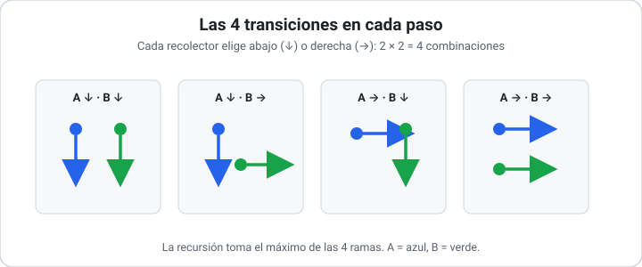

## Cherry Pickup — Fuerza Bruta

> Solución para el problema [Cherry Pickup (LeetCode #741)](0741_cherry_pickup.md).

### Técnicas utilizadas

- **Fuerza Bruta:** se exploran **todas** las posibilidades del espacio de soluciones sin descartar ramas mediante razonamiento, quedándose con la mejor. Acá, "todas las posibilidades" son todas las formas en que los dos recolectores pueden avanzar paso a paso.
- **Recursividad:** la exploración se expresa como una función que se invoca a sí misma, avanzando los recolectores un paso y delegando el resto del recorrido a las llamadas recursivas.

### Idea de la solución

Adoptamos la reformulación de **dos recolectores simultáneos** descripta en la [descripción del problema](0741_cherry_pickup.md): ambos parten de `(0,0)` y avanzan hacia `(N-1,N-1)` con movimientos abajo/derecha, dando siempre la misma cantidad de pasos.

Como tras `t` pasos un recolector en la fila `r` está forzosamente en la columna `t - r`, el estado completo se describe con tres valores: `(r1, c1, r2)`, donde la columna del segundo se deduce como `c2 = r1 + c1 - r2`.

En cada paso, cada recolector elige entre **abajo** o **derecha**: `2 × 2 = 4` combinaciones. La fuerza bruta consiste en **probar las cuatro** en cada nivel de la recursión y conservar la que maximiza las cerezas, sin ninguna poda ni reaprovechamiento de cálculos. Se suma `grid[r1][c1]`, y `grid[r2][c2]` sólo si los recolectores están en celdas distintas (para no contar dos veces la misma cereza).



### Código

```python
def cherry_pickup(grid):
    n = len(grid)

    def explorar(r1, c1, r2):
        c2 = r1 + c1 - r2          # ambos dieron los mismos pasos
        # Fuera de la grilla o sobre una espina -> camino inválido
        if (r1 >= n or c1 >= n or r2 >= n or c2 >= n or
                grid[r1][c1] == -1 or grid[r2][c2] == -1):
            return float('-inf')

        # Cerezas de esta celda (una sola vez si coinciden)
        cerezas = grid[r1][c1]
        if (r1, c1) != (r2, c2):
            cerezas += grid[r2][c2]

        # Caso base: ambos llegaron a la esquina final
        if r1 == n - 1 and c1 == n - 1:
            return cerezas

        # Probar las 4 combinaciones de movimientos (abajo/derecha)
        mejor = max(
            explorar(r1 + 1, c1,     r2 + 1),   # ambos abajo
            explorar(r1 + 1, c1,     r2    ),   # A abajo, B derecha
            explorar(r1,     c1 + 1, r2 + 1),   # A derecha, B abajo
            explorar(r1,     c1 + 1, r2    ),   # ambos derecha
        )
        return cerezas + mejor

    return max(0, explorar(0, 0, 0))   # 0 si todo camino es inválido
```

### Traza de ejemplo

Sobre la instancia de la descripción (`N = 3`, respuesta `5`). Anotamos cada estado como `(r1,c1 | r2,c2)` y mostramos sólo la rama que conduce al óptimo (la fuerza bruta explora **todas**, pero seguir las 4^pasos ramas completas sería inabarcable):

| Paso | Estado `(r1,c1 | r2,c2)` | `grid` celdas | Cerezas acumuladas |
| ---- | ---------------------- | ------------- | ------------------ |
| 0 | `(0,0 | 0,0)` | coinciden → `0` | 0 |
| 1 | `(0,1 | 1,0)` | `1 + 1` | 2 |
| 2 | `(1,1 | 2,0)` | `0 + 1` | 3 |
| 3 | `(2,1 | 2,1)` | coinciden → `1` | 4 |
| 4 | `(2,2 | 2,2)` | coinciden → `1` | 5 ✓ |

En el paso 3 ambos recolectores convergen en `(2,1)`: la cereza se cuenta **una sola vez**. La rama llega al caso base con `5`, y como ninguna otra combinación supera ese valor, `max(0, 5) = 5`.

Nótese que estados como `(2,1 | 2,1)` se alcanzan por **muchas** ramas distintas; la fuerza bruta recalcula su subárbol cada vez (justamente lo que corrige la [versión con memoización](0741_cherry_pickup-programacion-dinamica.md)).

### Complejidad

- **Temporal: `O(4^(2N))`.** El árbol de recursión tiene profundidad `2(N-1)` pasos (lo que tarda un recolector en cruzar la grilla) y un **factor de ramificación de 4** en cada nivel. Sin memoización, no se reaprovecha ningún subproblema repetido, de modo que el número de llamadas es exponencial. Para `N = 50` esto es astronómico.
- **Espacial: `O(N)`.** No se almacenan resultados; sólo se consume la pila de recursión, cuya profundidad es proporcional a la longitud de un camino, `2(N-1) = O(N)`.

### Cuándo usar esta técnica

La fuerza bruta es la herramienta correcta cuando el espacio de soluciones es **pequeño**, cuando se necesita un **prototipo de referencia obviamente correcto** contra el cual validar versiones optimizadas, o cuando el problema se resuelve una única vez sobre instancias diminutas.

Su **limitación** es fatal aquí: el costo `O(4^(2N))` la vuelve inviable incluso para grillas modestas (`N = 10` ya implica del orden de `4^18 ≈ 6.8 × 10^10` llamadas). El problema **exige** un enfoque que evite recomputar subproblemas.

Comparada con la [Programación Dinámica](0741_cherry_pickup-programacion-dinamica.md), comparte **exactamente la misma recursión y el mismo resultado**; la diferencia es puramente de eficiencia. La PD es estrictamente superior para este problema: añade una tabla de memoización que colapsa el costo de exponencial a polinómico `O(N^3)`, a cambio de `O(N^3)` de memoria. La fuerza bruta sólo conserva valor **didáctico** (deja ver la idea central sin la maquinaria del cache) y como **oráculo de testing** para instancias chicas.

### Referencias

- LeetCode 741 — *Cherry Pickup*: https://leetcode.com/problems/cherry-pickup/
- Cormen, Leiserson, Rivest, Stein — *Introduction to Algorithms* (3ª ed.), Cap. 15 (motivación de PD a partir de recursión exhaustiva).
