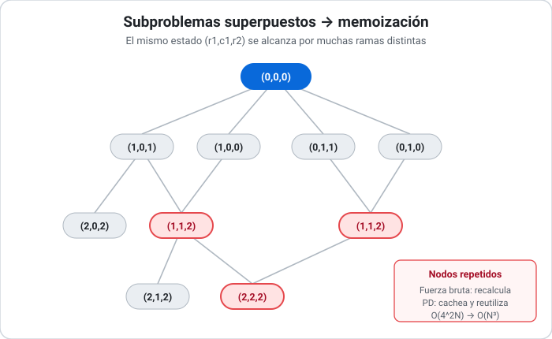

## Cherry Pickup — Programación Dinámica

> Solución para el problema [Cherry Pickup (LeetCode #741)](0741_cherry_pickup.md).

### Técnicas utilizadas

- **Programación Dinámica (PD):** se descompone el problema en subproblemas que se **solapan**, se resuelve cada uno **una sola vez** y se guarda su resultado para reutilizarlo. Es aplicable porque el problema tiene **subestructura óptima** (la mejor solución global se arma con las mejores soluciones de sus subproblemas) y **subproblemas superpuestos** (el mismo estado se alcanza por muchos caminos).
- **Memoización (PD *top-down*):** se conserva la recursión natural de la [fuerza bruta](0741_cherry_pickup-fuerza-bruta.md) y se la envuelve con un cache: antes de computar un estado se consulta si ya fue resuelto.

### Idea de la solución

La recursión de los **dos recolectores** ya identifica el estado mínimo: `(r1, c1, r2)`, con `c2 = r1 + c1 - r2` deducible. Hay `O(N^3)` estados posibles, pero la fuerza bruta los visita una cantidad **exponencial** de veces porque el mismo `(r1, c1, r2)` se alcanza por múltiples combinaciones de movimientos previos.

La PD ataca exactamente ese desperdicio: la **primera** vez que se resuelve un estado, su resultado se guarda en una tabla de memoización (un [[Mapa _ Diccionario|diccionario]] indexado por `(r1, c1, r2)`); las veces siguientes se devuelve el valor cacheado en `O(1)`. Así, cada uno de los `O(N^3)` estados se computa **una única vez**, transformando el costo de exponencial a polinómico **sin cambiar la lógica** ni el resultado.



### Código

```python
from functools import lru_cache

def cherry_pickup(grid):
    n = len(grid)

    @lru_cache(maxsize=None)          # <-- memoización: el único cambio real
    def explorar(r1, c1, r2):
        c2 = r1 + c1 - r2
        if (r1 >= n or c1 >= n or r2 >= n or c2 >= n or
                grid[r1][c1] == -1 or grid[r2][c2] == -1):
            return float('-inf')

        cerezas = grid[r1][c1]
        if (r1, c1) != (r2, c2):
            cerezas += grid[r2][c2]

        if r1 == n - 1 and c1 == n - 1:
            return cerezas

        return cerezas + max(
            explorar(r1 + 1, c1,     r2 + 1),
            explorar(r1 + 1, c1,     r2    ),
            explorar(r1,     c1 + 1, r2 + 1),
            explorar(r1,     c1 + 1, r2    ),
        )

    return max(0, explorar(0, 0, 0))
```

El cuerpo es **idéntico** al de la fuerza bruta; la única diferencia es el decorador `@lru_cache` (equivalente a un diccionario `memo[(r1,c1,r2)]` gestionado a mano). Esa línea es la que convierte el algoritmo de inviable a eficiente.

### Traza de ejemplo

Sobre la misma instancia (`N = 3`, respuesta `5`). La rama óptima es la misma que en la fuerza bruta; lo que cambia es **qué ocurre con los estados repetidos**:

| Estado `(r1,c1,r2)` | `c2` | ¿En cache? | Acción |
| ------------------- | ---- | ---------- | ------ |
| `(0,0,0)` | 0 | no | computa → explora 4 hijos |
| `(0,1,1)` | 0 | no | computa (cerezas `1+1=2`) |
| `(1,1,2)` | 0 | no | computa (cerezas `0+1=1`) |
| `(2,1,2)` | 1 | no | computa (coinciden → `1`) |
| `(2,2,2)` | 2 | no | caso base → `1` |
| `(2,1,2)` | 1 | **sí** | devuelve valor cacheado en `O(1)` |
| `(1,1,2)` | 0 | **sí** | devuelve valor cacheado en `O(1)` |

Las dos últimas filas muestran el ahorro: estados que la fuerza bruta volvería a expandir por completo, la PD los resuelve consultando la tabla. El valor final propagado a `(0,0,0)` es `5`, y `max(0, 5) = 5`.

### Complejidad

- **Temporal: `O(N^3)`.** Hay `N × N × N = O(N^3)` estados distintos `(r1, c1, r2)`, y cada uno se computa **una sola vez** (gracias al cache) realizando trabajo `O(1)` (cuatro consultas y un `max`). Para `N = 50` son a lo sumo `125 000` estados, perfectamente factible —frente a las `~10^21` llamadas de la fuerza bruta.
- **Espacial: `O(N^3)`.** Domina la tabla de memoización, que puede almacenar hasta un valor por estado. La pila de recursión aporta `O(N)`, despreciable frente a lo anterior.

### Cuándo usar esta técnica

La PD es la elección indicada cuando se reconocen las **dos señales** que aquí están presentes: **subestructura óptima** y **subproblemas superpuestos**. La pista práctica es directa: si una solución recursiva natural recalcula los mismos estados una y otra vez, memoizar suele bajar el costo de exponencial a polinómico.

Sus **limitaciones**: paga memoria por velocidad (aquí `O(N^3)`, que para `N` muy grande podría ser un problema), y requiere que el estado sea **acotado y bien identificado** —si los estados casi no se repiten, la memoización no ayuda y sólo agrega overhead.

Comparada con la [Fuerza Bruta](0741_cherry_pickup-fuerza-bruta.md), es **estrictamente superior para este problema**: produce el mismo resultado con idéntica lógica, pero pasa de `O(4^(2N))` a `O(N^3)` en tiempo, a cambio de `O(N^3)` de memoria (frente a `O(N)` de la fuerza bruta). La fuerza bruta sólo conviene como referencia conceptual o como oráculo de testing en instancias diminutas; **para resolver el problema de verdad, se usa la PD**.

> Variante: esta versión es *top-down* (memoización). Existe una formulación *bottom-up* equivalente que llena una tabla 3D iterando `t = 0 … 2(N-1)`, con la misma complejidad `O(N^3)` y la ventaja de evitar el límite de profundidad de recursión.

### Referencias

- LeetCode 741 — *Cherry Pickup*: https://leetcode.com/problems/cherry-pickup/
- Cormen, Leiserson, Rivest, Stein — *Introduction to Algorithms* (3ª ed.), Cap. 15: Dynamic Programming.
- Documentación de Python — `functools.lru_cache`: https://docs.python.org/3/library/functools.html#functools.lru_cache
