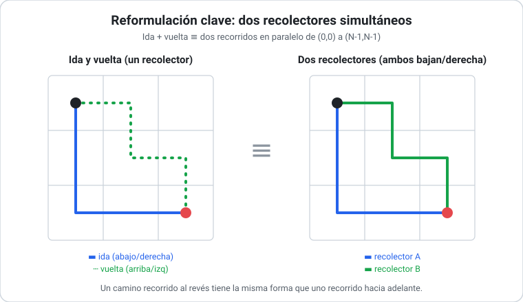
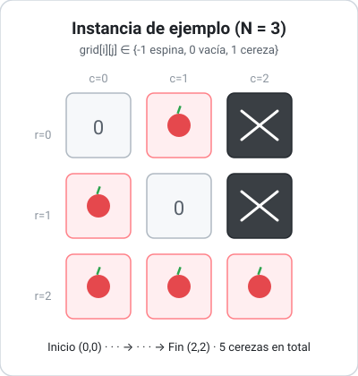
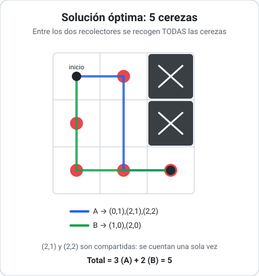
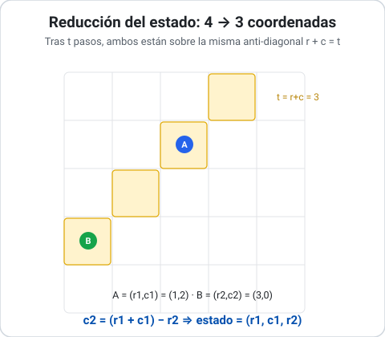

## Cherry Pickup (LeetCode #741)

### Enunciado

Tenemos una grilla cuadrada `grid` de tamaño `N × N` donde cada celda contiene uno de tres valores:

- `0`: celda vacía y transitable.
- `1`: celda con una **cereza** transitable (al pasar, la cereza se recolecta y la celda queda en `0`).
- `-1`: celda con una **espina**, intransitable.

Un recolector parte de la esquina superior izquierda `(0, 0)` y debe llegar a la esquina inferior derecha `(N-1, N-1)` moviéndose únicamente **hacia abajo o hacia la derecha**. Una vez allí, debe **regresar** a `(0, 0)` moviéndose únicamente **hacia arriba o hacia la izquierda**.

El objetivo es **maximizar la cantidad total de cerezas recolectadas** en el viaje de ida y vuelta. Si no existe ningún camino válido entre `(0, 0)` y `(N-1, N-1)` (porque las espinas lo bloquean), la respuesta es `0`.

> Enunciado original: [LeetCode 741 — Cherry Pickup](https://leetcode.com/problems/cherry-pickup/)

### Intuición

Lo que vuelve al problema interesante es que **no se puede resolver optimizando cada viaje por separado**. La tentación natural es: "busco el mejor camino de ida, recolecto, y luego el mejor camino de vuelta". Pero ese enfoque codicioso **falla**: el mejor camino de ida puede agotar las cerezas que necesitaba la vuelta, dejando un resultado subóptimo. Las dos trayectorias están **acopladas** porque comparten un mismo tablero que se va vaciando.

La observación clave que destraba el problema es de **simetría**: un viaje de ida `(0,0) → (N-1,N-1)` seguido de uno de vuelta `(N-1,N-1) → (0,0)` es equivalente a **dos recolectores que parten simultáneamente** de `(0,0)` y avanzan, ambos, hacia `(N-1,N-1)` usando sólo movimientos abajo/derecha. Un camino recorrido "al revés" tiene exactamente la misma forma que uno recorrido "hacia adelante". Esta reformulación es lo que permite razonar sobre ambos recorridos a la vez.



### Definición formal

- **Entrada:** una matriz `grid` de `N × N` con `grid[i][j] ∈ {-1, 0, 1}`. Se garantiza `grid[0][0] != -1` y `grid[N-1][N-1] != -1`.
- **Salida:** un entero, la máxima cantidad de cerezas recolectables en el recorrido ida + vuelta. `0` si el camino está bloqueado.
- **Restricciones:** `1 ≤ N ≤ 50`. Movimientos de ida restringidos a abajo/derecha; de vuelta a arriba/izquierda. Cada cereza se cuenta **una sola vez** aunque ambos recorridos pasen por la misma celda.

La estructura subyacente es una [[Matriz|grilla/matriz]] sobre la que se definen caminos monótonos.

### Ejemplo concreto

```
grid = [[ 0,  1, -1],
        [ 1,  0, -1],
        [ 1,  1,  1]]
```



El tablero tiene `5` cerezas (en `(0,1)`, `(1,0)`, `(2,0)`, `(2,1)`, `(2,2)`) y dos espinas que bloquean toda la columna derecha superior.

Pensándolo como **dos recolectores simultáneos**:

- Recolector A: `(0,0) → (0,1) → (1,1) → (2,1) → (2,2)`, recolecta `(0,1)`, `(2,1)`, `(2,2)`.
- Recolector B: `(0,0) → (1,0) → (2,0) → (2,1) → (2,2)`, recolecta `(1,0)`, `(2,0)` (las celdas `(2,1)` y `(2,2)` ya fueron contadas por A).

Total: `5` cerezas. Es el máximo posible, ya que entre ambos recogen **todas** las cerezas del tablero.



**Respuesta esperada: `5`.**

### Por dónde empezar

1. Convencerse de que el enfoque codicioso (optimizar ida y vuelta por separado) es incorrecto con un contraejemplo.
2. Adoptar la reformulación de **dos recolectores que caminan en paralelo** de `(0,0)` a `(N-1,N-1)`.
3. Notar que ambos recolectores dan **la misma cantidad de pasos** en todo momento: tras `t` pasos, un recolector en la fila `r` está en la columna `t - r`. Esto reduce el estado de cuatro coordenadas `(r1, c1, r2, c2)` a sólo **tres** `(r1, c1, r2)`, porque `c2 = r1 + c1 - r2`.
4. Plantear la recursión sobre ese estado y, recién después, atacar el costo agregando memoización.



### Soluciones disponibles

- [Fuerza Bruta (recursión de dos recolectores)](0741_cherry_pickup-fuerza-bruta.md) — enumera exhaustivamente todas las combinaciones de movimientos.
- [Programación Dinámica (memoización)](0741_cherry_pickup-programacion-dinamica.md) — misma recursión, evitando recomputar estados repetidos.
